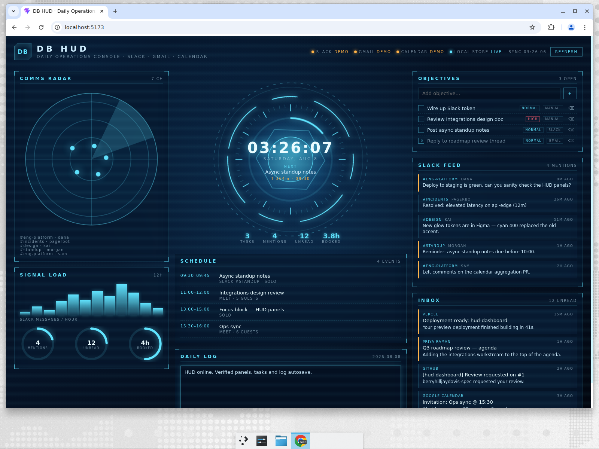

# DB HUD

A sci-fi heads-up display for your day: daily notes, tasks, Slack chatter, Gmail and Google
Calendar on one glowing console.



## What's on screen

| Region | Contents |
| --- | --- |
| Centre core | Live clock, day progress ring, next calendar event with countdown, headline counters |
| Schedule | Today's calendar, colour-coded past / live / upcoming |
| Daily Log | Free-form note for the day, autosaved |
| Objectives | Task list — add, complete, delete |
| Slack Feed | Recent messages from your channels, mentions highlighted |
| Inbox | Recent Gmail with unread emphasis |
| Comms Radar / Signal Load | Slack blips by recency, messages-per-hour bars, ring gauges |

Every integration degrades gracefully: with no credentials the panel renders demo data and the
status bar marks it `DEMO`, so the HUD is always presentable.

## Run it

```bash
npm install
cp .env.example .env   # optional — fill in what you have
npm run dev            # API on :8787, UI on http://localhost:5173
```

Production-ish single process:

```bash
npm run build && npm start   # serves dist/ + /api from :8787
```

## Connecting real data

See `.env.example` for the exact variables. Summary:

- **Slack** — create an app at <https://api.slack.com/apps>, add the bot scopes
  `channels:history`, `channels:read`, `groups:history`, `groups:read`, `users:read`, install it,
  invite it to the channels you care about, then set `SLACK_TOKEN`.
- **Gmail + Google Calendar** — one OAuth client covers both. Enable the Gmail and Calendar APIs,
  create an OAuth client, and exchange a consent code for a refresh token with the two read-only
  scopes. Set `GOOGLE_CLIENT_ID`, `GOOGLE_CLIENT_SECRET`, `GOOGLE_REFRESH_TOKEN`.
- **Notes and tasks** — stored locally in `data/notes.json` (path configurable via
  `HUD_DATA_FILE`). No external service required.

Credentials stay server-side; the browser only ever talks to this app's `/api`.

## API

| Method | Path | Purpose |
| --- | --- | --- |
| `GET` | `/api/dashboard` | Aggregated payload for the whole HUD, including per-source status |
| `PUT` | `/api/note` | Replace today's note body |
| `POST` | `/api/tasks` | Create a task (`{ title, priority? }`) |
| `POST` | `/api/tasks/:id/toggle` | Toggle done |
| `DELETE` | `/api/tasks/:id` | Delete a task |

## Layout

```
server/   Express API: provider adapters (slack.ts, google.ts), JSON store, mock data
shared/   Types shared by server and client
src/      React HUD — components/ holds the panels, hud.css holds the whole visual language
```

## Adding a source

1. Write `server/<source>.ts` exporting an async fetch returning a typed summary.
2. Add a mock in `server/mock.ts` and the shape to `shared/types.ts`.
3. Register it in `/api/dashboard` via `withFallback` so it downgrades to mock data on failure.
4. Render it with `<Panel>` in `src/App.tsx`.

## Scripts

`npm run dev` · `npm run build` · `npm run typecheck` · `npm run lint` · `npm start`
